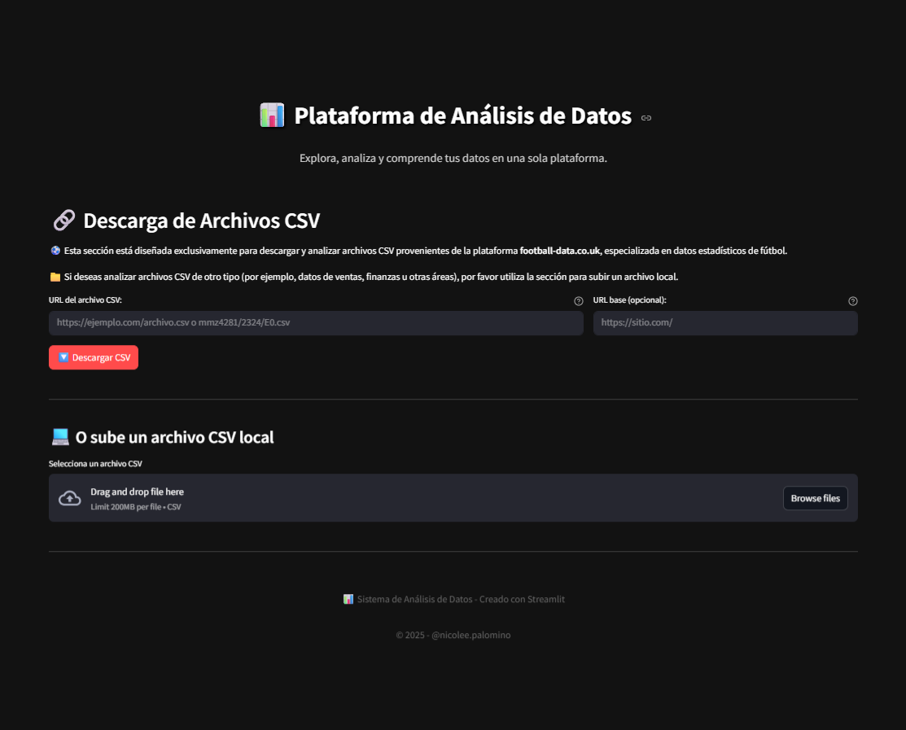
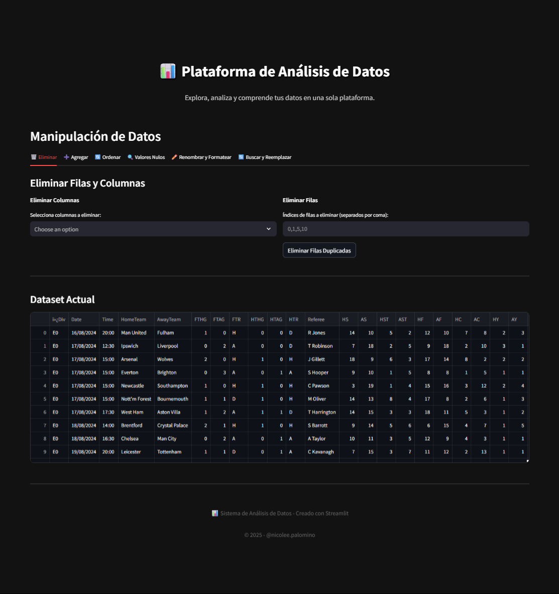
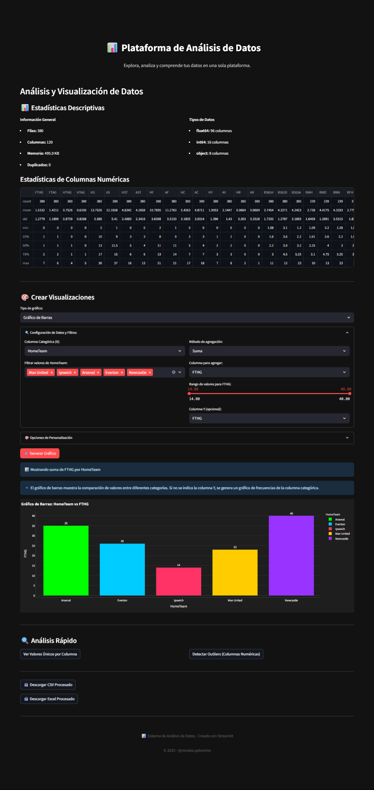
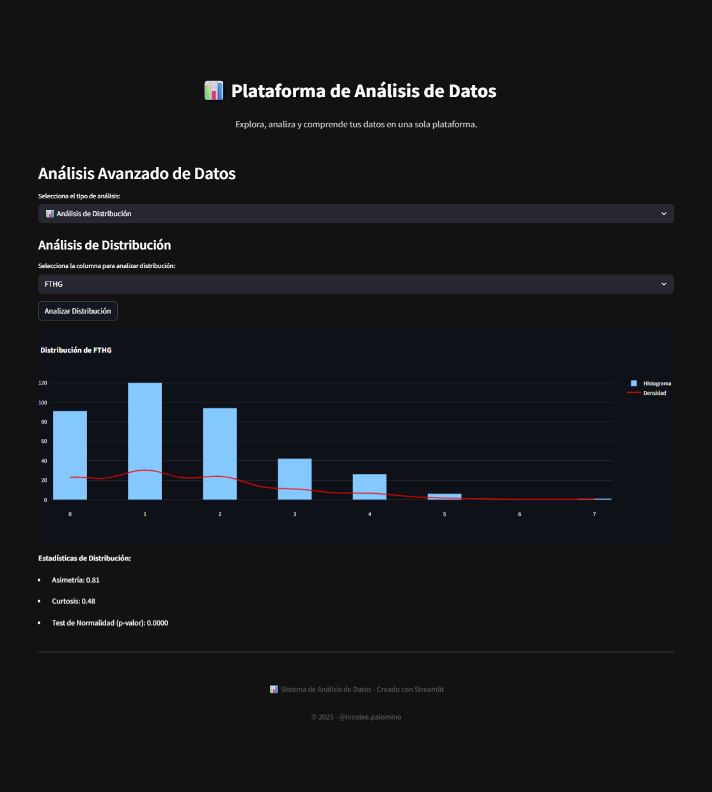

# 📊 Data Analytics Platform

Una plataforma interactiva desarrollada con [Streamlit](https://streamlit.io) que permite cargar, manipular, analizar y visualizar datos desde archivos CSV, ya sea desde URLs específicas como **football-data.co.uk** o desde archivos locales. El sistema ofrece múltiples funcionalidades estadísticas, visualizaciones dinámicas, análisis avanzado, segmentación y predicción.

## 🚀 Características Principales

- **Descarga de CSV desde URL**  
  Diseñado para trabajar con URLs relativas y absolutas de [football-data.co.uk](https://www.football-data.co.uk). También permite subir archivos locales.

- **Manipulación de Datos**  
  Funcionalidades como eliminar, agregar, ordenar columnas/filas, tratar valores nulos, renombrar columnas, formatear fechas y reemplazar valores.

- **Análisis de Datos**  
  Estadísticas descriptivas, análisis de outliers, conteo de valores únicos, filtros dinámicos, gráficos personalizables (barras, líneas, circulares, box plot, violin plot, etc.).

- **Análisis Avanzado**  
  Incluye:
  - Análisis de tendencias y anomalías
  - Series temporales con descomposición
  - Distribuciones y pruebas de normalidad
  - Correlaciones y regresiones
  - Clustering (K-means y jerárquico)
  - Análisis de secuencias

- **Exportación de Resultados**  
  Descarga de datasets procesados en formatos `.csv` y `.xlsx`.

## 🛠️ Tecnologías Utilizadas

- **Frontend:** Streamlit + CSS personalizado (modo oscuro y responsive)
- **Visualización:** Plotly, Seaborn, Matplotlib
- **Procesamiento de Datos:** Pandas, NumPy
- **Machine Learning & Estadística:** Scikit-learn, Statsmodels, SciPy

## 📦 Requisitos

Instala los paquetes necesarios con:

```bash
pip install -r requirements.txt
```

O manualmente:

```bash
pip install streamlit pandas numpy plotly seaborn matplotlib scikit-learn statsmodels
```

## ▶️ Cómo Ejecutar

```bash
streamlit run app.py
```

Luego abre en tu navegador el enlace que aparece, típicamente: `http://localhost:8501`

## 📂 Estructura del Proyecto

```
.
├── app.py                   # Archivo principal de Streamlit
├── src/
│   ├── download.py          # Función para descargar CSV desde URL
│   ├── create_plot.py       # Función para crear gráficos personalizados
│   └── advanced.py          # Funciones para análisis avanzado
```

## ✨ Capturas de Pantalla
> Página de Inicio


> Página de Manipulación de Datos


> Página de Análisis de Datos


> Página de Análisis Avanzado

## 🌍 Plataforma en Línea

Accede a la aplicación desplegada aquí: [https://datanalystlab.streamlit.app/](https://datanalystlab.streamlit.app/)

## 🧠 Créditos

Desarrollado por [Nicole Palomino (@nicolee.palomino)](#) como una solución integral de análisis de datos personalizable.